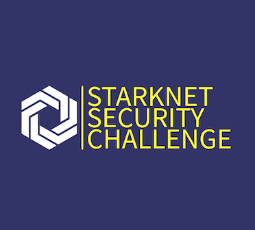
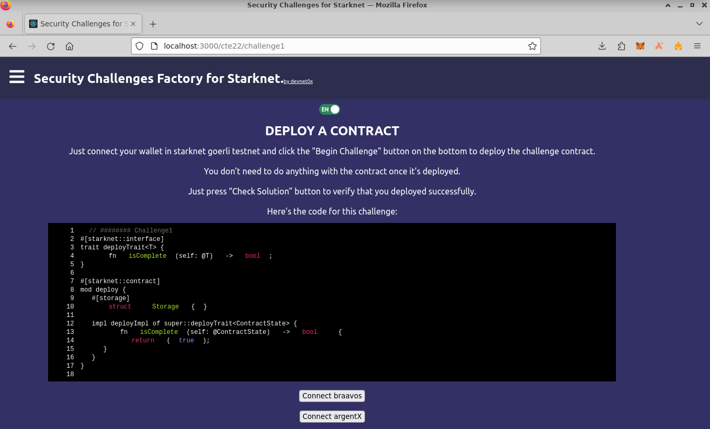

# INTRODUCTION
Starknet Security Challenges Factory is an open source platform where you can build Starknet CTFs, earn points, keep records on a leaderboard and mint nfts (worth nothing, just for fun) to challenge resolutors. You can see a live version [here.](https://starknet-challenges.vercel.app/) 

Here you will find:

* [Requirements to install as a local CTF.](#requirements)

* [How to install in local devnet.](#how-to-install)

* [How to add challenges and contribute.](#how-to-add-a-challenge)

* [How it works in background.](#how-it-works)

# REQUIREMENTS
- python3.9

- rust 
```
sudo curl --proto '=https' -tslv1.2 -sSf https://sh.rustup.rs | sh
```
- cairo v2.0.0
```
git clone https://github.com/starkware-libs/cairo/
cd cairo
git checkout tags/v2.0.0
cargo build --all --release
```
- cairo_lang v0.12
```
pip3 install cairo-lang
```
- starknet-devnet 0.5.5+
```
sudo apt install -y libgmp3-dev
pip install starknet-devnet
```
- starknet-py 0.170a0+
```
pip install starknet-py==0.17.0a0
```
- node v16.16.0
```
sudo apt-get update
curl -fsSL https://deb.nodesource.com/setup_16.x | sudo -E bash -
sudo apt-get install -y nodejs
```

# HOW TO INSTALL
1) Start a local devnet with seed 0
```
starknet-devnet --seed 0 
```
2) Clone repository
```
git clone https://github.com/devnet0x/Starknet-Security-Challenges-Factory
```
3) Deploy contracts to local devnet
```
cd Starknet-Security-Challenges-Factory
python setup.py
```
4) Install and start web3 platform
```
npm install
npm start run
```
5) Connect your Argentx or Braavos wallet to devnet and play at:
```
http://localhost:3000
```


# HOW TO ADD A CHALLENGE
1) Compile your Cairo2 challenge with a isComplete function returning true when challenge is completed.

2) Edit $HOME/.starknet_accounts/starknet_open_zeppelin_accounts.json and add devnet account to "alpha-goerli" structure:
```
    "admin": {
        "private_key": "0xe3e70682c2094cac629f6fbed82c07cd",
        "public_key": "0x7e52885445756b313ea16849145363ccb73fb4ab0440dbac333cf9d13de82b9",
        "salt": "0x0",
        "address": "0x7e00d496e324876bbc8531f2d9a82bf154d1a04a50218ee74cdd372f75a551a",
        "deployed": true
    }
```
3) Declare your Cairo2 challenge in devnet.
```
export STARKNET_NETWORK=alpha-goerli
export STARKNET_WALLET=starkware.starknet.wallets.open_zeppelin.OpenZeppelinAccount

starknet --gateway_url http://127.0.0.1:5050 --feeder_gateway_url http://127.0.0.1:5050 --account admin declare --contract <challenge_sierra_file>
```
4) Add your challenge to main contract.
```
starknet --gateway_url http://127.0.0.1:5050 --feeder_gateway_url http://127.0.0.1:5050 --account admin invoke --max_fee 1000000000000000 --address <devnet_proxy_main_address> --function updateChallenge --inputs <challenge_number> <challenge_class_hash> <challenge_points>


For example:
export STARKNET_NETWORK=alpha-goerli
export STARKNET_WALLET=starkware.starknet.wallets.open_zeppelin.OpenZeppelinAccount
starknet --gateway_url http://127.0.0.1:5050 --feeder_gateway_url http://127.0.0.1:5050 --account admin invoke --max_fee 1000000000000000 --address 0x34c07e42599cd772efa07a7ffb8ea98bce9497cd01a0fa48c601f0000422e10 --function updateChallenge --inputs 21 0x1c0aaac8308084dc8fbeaea90c0c3e69d18d63f1f51062d2b8782ba10423e7d 200
```
5) Check with:
```
starknet --gateway_url http://127.0.0.1:5050 --feeder_gateway_url http://127.0.0.1:5050 tx_status --hash <your_previous_tx_hash>

{
    "block_hash": "0x1ac55d27761ec8f377b216cedbac57409e82efc631112aaad2e9bc722b182af",
    "tx_status": "ACCEPTED_ON_L2"
}
```
6) Add your .cairo file to src/assets
7) Add your nft image file to src/assets/nft
8) Add your nft json file to src/assets/nft
9) Edit src/components/Challenge.jsx and add your challenge and descriptions.
10) Edit src/layout/components/menu_config.js and add your challenge to the menu.
11) Edit src/App.js and add challenge to page route.
12) Edit config.py and add your challenge in CHALLENGE_CONTRACTS.
13) Test your challenge in http://localhost:3000
14) Edit global.jsx and restore testnet main proxy to:
```
global.MAIN_CONTRACT_ADDRESS='0x0667b3f486c25a9afc38626706fb83eabf0f8a6c8a9b7393111f63e51a6dd5dd';
```
14) Send your PR to github.

# HOW IT WORKS


1) User press deploy button in web interface.
2) Starknet-react library calls deploy function on main contract.
3) Main contract deploys a challenge instance to user.
4) User exploit and solve challenge.
5) User press check button in web interface.
6) Starknet-react library calls check function on main contract.
7) Main contract calls isComplete funcion in challenge instance.
8) If isComplete returns true then:
* Main contracts add points to user record (displayed in leaderboard).
* Mint button appears in web interface.
9) User press mint button
10) Starknet-react library calls mint function on main contract.
11) Main contract calls mint funcion in nft smart contract.
12) User can press link in web interface to watch his nft.

# HOW TO DEPLOY WEB3 PLATFORM IN PRODUCTION (ONLY PRODUCTION ADMINS).
1) Commit PR
2) Clone Repository
```
git clone https://github.com/devnet0x/Starknet-Security-Challenges-Factory
```
3) Compile challenge.
```
cd cairo
cargo run --bin starknet-compile ./src/assets/challenge.cairo challenge.sierra
```
4) Declare challenge.
```
export STARKNET_NETWORK=alpha-goerli
export STARKNET_WALLET=starkware.starknet.wallets.open_zeppelin.OpenZeppelinAccount //utiliza el DEFAULT
starknet --account __default__ declare --contract challenge.sierra
```
5) On starkscan/voyager invoke updateChallenge function to add challenge.
```
proxy_main:0x0667b3f486c25a9afc38626706fb83eabf0f8a6c8a9b7393111f63e51a6dd5dd
```
6) Upload to test environment.
```
vercel login
vercel link (to: starknet-challenges)
vercel (if error then check node version in vercel.com project settings)
```
7) Test interface.

8) Upload to production environment.
```
vercel --prod
```

# HOW TO UPGRADE CORE CONTRACTS (ONLY PRODUCTION ADMINS)

1) Declare new main.cairo or nft.cairo smart contract.
2) On starkscan/voyager read getImplementationHash in case of rollback.
```
proxy_main:0x0667b3f486c25a9afc38626706fb83eabf0f8a6c8a9b7393111f63e51a6dd5dd
proxy_nft :0x007d85f33b50c06d050cca1889decca8a20e5e08f3546a7f010325cb06e8963f
```
3) On starkscan/voyager invoke upgrade function with new core implementation hash.
```
WARNING!!! IF CLASS_HASH DOESN'T EXIST WE WILL LOST DATA AND PROXY FUNCTIONS.
```
